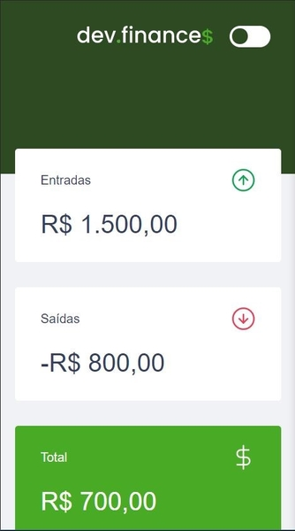
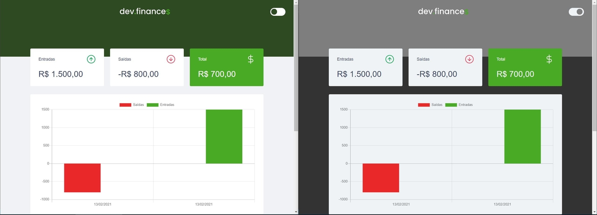
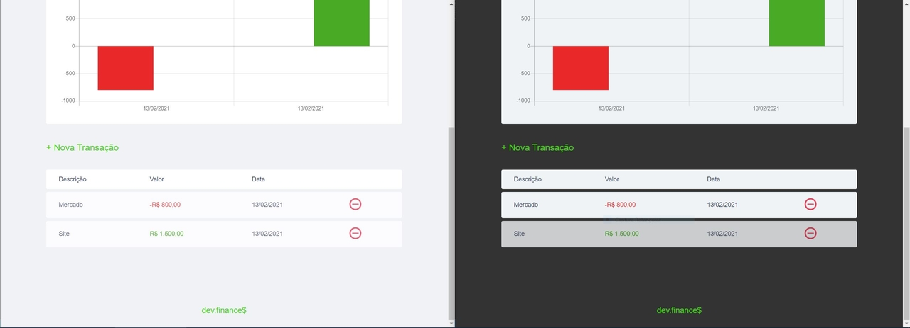
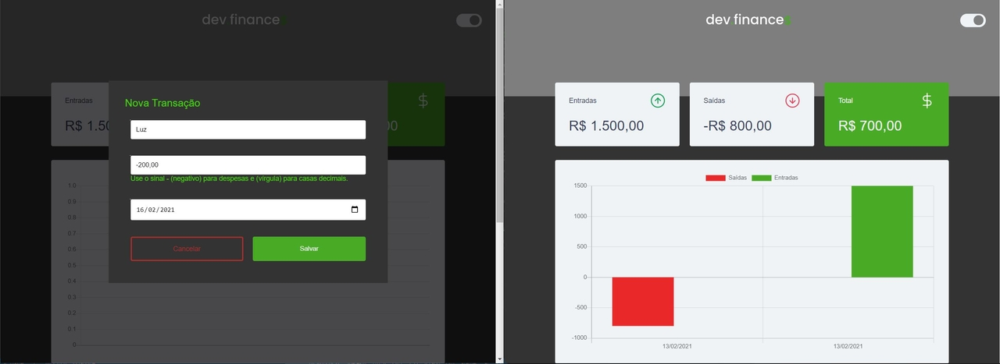

# Maratona Discover

## Dev.finance$ 
[](https://github.com/devsuperior/sds1-wmazoni/blob/master/LICENSE) 

### Sobre o Projeto
Dev.finance$ é uma front-end web construída durante a 1ª edição da **Maratona Discover**, um evento realizado pela [Rocketseat](https://rocketseat.com.br/).

A aplicação consiste em uma interface web para controle de finanças, onde os dados são coletados e listados na web, além disso foram implementados duas funções como exercício.

### Layout Responsivo Mobile



### Layout Padrão Web







### Tecnologias utilizadas
- JavaScript
- CSS
- HTML
- Chart.js

### instalar dependências
```
#  npm install chart.js --save
```

### Autor
Erik Stellet Brito dos Santos

https://www.linkedin.com/in/erikstellet
